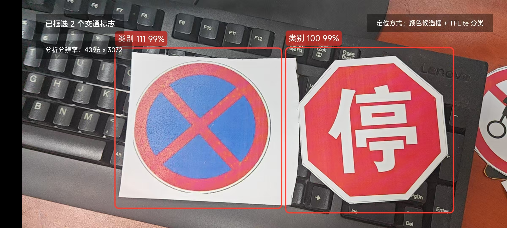
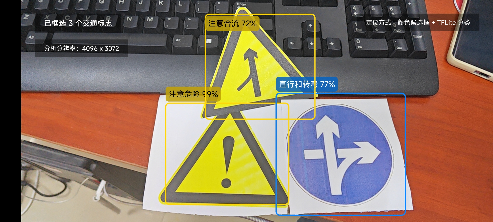
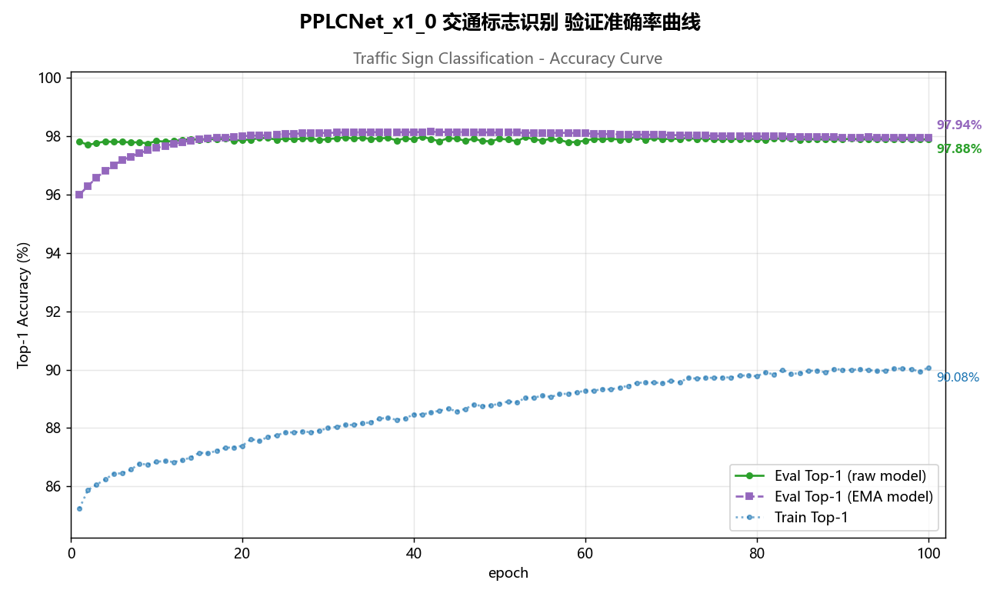
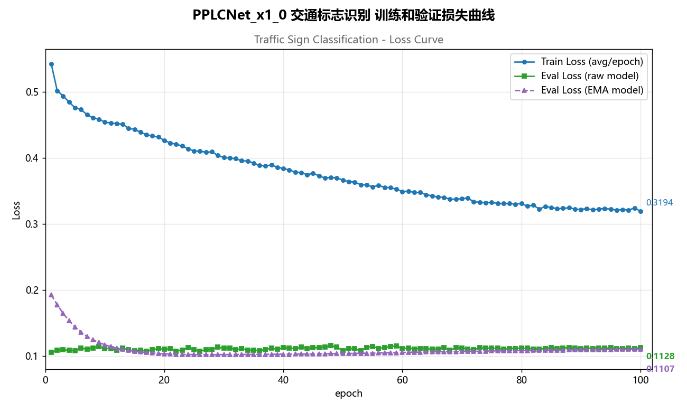

# TrafficSign Demo

一个基于 Android 的实时交通标志识别 Demo，主打简洁直观的演示效果：

- 纯摄像头实时画面
- 候选区域框选
- 标签名 + 置信度叠加显示
- 本地端侧推理，无需联网

当前实现采用两阶段流水线：

1. 先基于颜色和形状规则，从画面中定位交通标志候选框
2. 再对候选区域做裁剪，并使用 TensorFlow Lite 分类模型输出标签

界面效果就是你现在看到的这种风格: 保留原始摄像头画面，只叠加标签框和识别结果，适合做课程设计、算法演示、端侧视觉 Demo 和移动端识别原型。

## Demo 截图

### 示例 1



### 示例 2



### 训练曲线图





## 功能特性

- 基于 `CameraX` 实现实时相机预览与图像分析
- 横屏沉浸式展示，适合现场演示
- 基于颜色候选框的交通标志区域提取
- 基于 `TensorFlow Lite` 的交通标志分类
- 在预览层上绘制边框、标签和置信度
- 支持本地模型与标签文件直接放在 `assets` 中运行

## 技术方案

项目核心链路如下：

```text
CameraX 取流
  -> ImageProxy 转 Bitmap
  -> 颜色/形状规则筛选候选区域
  -> 裁剪候选区域
  -> TFLite 分类
  -> Overlay 绘制标签框与分数
```

当前页面文案中的识别方式为：

```text
定位方式：颜色候选框 + TFLite 分类
```

这意味着本项目不是直接做端到端目标检测，而是采用更轻量、也更容易理解的「候选框定位 + 分类识别」方案。对于 Demo 展示场景，这种方式开发和调试成本更低，页面也更清爽。

## 项目结构

```text
app/src/main/
├─ assets/
│  ├─ traffic_sign_100ep_float32.tflite
│  ├─ traffic_sign_100ep_float16.tflite
│  └─ traffic_sign_label_list.txt
├─ java/com/trafficsign/demo/paddleclas/
│  ├─ MainActivity.kt
│  ├─ TrafficSignCandidateDetector.kt
│  ├─ TrafficSignRecognizer.kt
│  ├─ DetectionOverlayView.kt
│  ├─ ImageUtils.kt
│  ├─ AssetUtils.kt
│  ├─ DemoModelConfig.kt
│  └─ InferenceModels.kt
└─ res/
   └─ layout/activity_main.xml
```

关键文件说明：

- `MainActivity.kt`：相机启动、权限申请、CameraX 绑定、实时分析调度
- `TrafficSignCandidateDetector.kt`：基于颜色和几何特征的候选框提取
- `TrafficSignRecognizer.kt`：裁剪候选区域并执行 TFLite 分类
- `DetectionOverlayView.kt`：在画面上绘制标签框、类别名和置信度
- `DemoModelConfig.kt`：模型路径、输入尺寸、TopK 等配置

## 运行环境

- Android Studio
- Android SDK `minSdk 24`
- `targetSdk 36`
- Java 11
- Android 真机，且设备具备摄像头权限

## 快速运行

1. 使用 Android Studio 打开项目
2. 等待 Gradle 同步完成
3. 连接 Android 真机
4. 授予相机权限
5. 启动应用后，将交通标志图片或实物放入画面中进行识别

## 模型与标签

项目当前默认使用以下资源：

- 模型：`app/src/main/assets/traffic_sign_100ep_float32.tflite`
- 备用模型：`app/src/main/assets/traffic_sign_100ep_float16.tflite`
- 标签：`app/src/main/assets/traffic_sign_label_list.txt`

默认输入尺寸为 `224 x 224`，TopK 输出为 `5`。

如果你要替换成自己的模型，通常只需要修改：

- `DemoModelConfig.kt` 中的模型路径
- 输入尺寸
- 标签文件内容

## 适用场景

- Android 端侧视觉识别 Demo
- 交通标志识别课程设计
- TFLite 部署演示
- CameraX 实时图像分析示例
- 轻量级候选框 + 分类识别原型

## 当前方案说明

这个项目目前更偏向「演示型工程」，重点是：

- 页面尽量简洁，只保留摄像头画面与识别框
- 识别链路可读性高，方便学习与二次开发
- 模型和标签直接内置在 `assets` 中，运行门槛低

如果你后续要继续增强，可以考虑：

- 换成目标检测模型，减少候选框规则依赖
- 增加更多交通标志类别和更规范的标签映射
- 增加拍照保存、推理耗时统计、录屏演示等功能
- 对不同光照、角度、背景做更强的鲁棒性优化

## 开源说明

本仓库适合作为个人学习、课程设计展示、移动端视觉识别 Demo 的开源项目模板。

如果你准备发布到 GitHub，建议仓库名称使用：

- `TrafficSignDemo`
- `android-traffic-sign-demo`
- `camera-tflite-traffic-sign-demo`

## License

本项目采用 MIT License，详见 [LICENSE](./LICENSE)。
